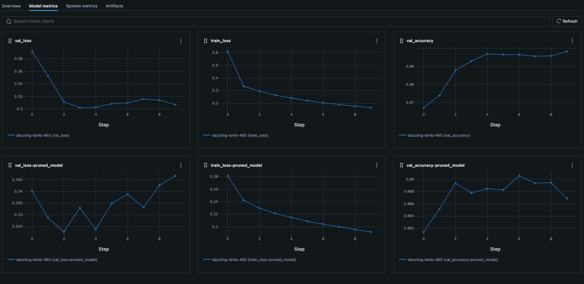

# cnn-pruning

## Introduction

 This repository is a PyTorch implementation of the taylor expansion criterion found in [*Pruning Convolutional Neural Networks for Resource Efficient Inference*](https://arxiv.org/pdf/1611.06440.pdf), testing the performance of a simple CNN model with only 2 convolutional layers on FashionMNIST after pruning.

## How to run

### MLflow

In order to launch the MLflow tracking server, run the command below

    mlflow server --host 127.0.0.1 --port 5000

in a separate terminal window.

### Train

First, make sure to export the current working directory via the command `export PYTHONPATH=$(pwd)`. Once MLflow server has started, train, prune, and fine-tune the model running the command below:

    python src/scripts/train.py

## Results

### Before pruning

    =================================================================
    Layer (type:depth-idx)                   Param #
    =================================================================
    CNN                                      --
    ├─Sequential: 1-1                        --
    │    └─Conv2d: 2-1                       80
    │    └─ReLU: 2-2                         --
    │    └─Conv2d: 2-3                       1,168
    │    └─ReLU: 2-4                         --
    │    └─Flatten: 2-5                      --
    │    └─Linear: 2-6                       125,450
    =================================================================
    Total params: 126,698
    Trainable params: 126,698
    Non-trainable params: 0
    =================================================================

### After pruning

    =================================================================
    Layer (type:depth-idx)                   Param #
    =================================================================
    CNN                                      --
    ├─Sequential: 1-1                        --
    │    └─Conv2d: 2-1                       70
    │    └─ReLU: 2-2                         --
    │    └─Conv2d: 2-3                       640
    │    └─ReLU: 2-4                         --
    │    └─Flatten: 2-5                      --
    │    └─Linear: 2-6                       78,410
    =================================================================
    Total params: 79,120
    Trainable params: 79,120
    Non-trainable params: 0
    =================================================================

### Metrics

The original model was trained for 5 epochs and the pruned model was fine-tuned for another 5 epochs. Observe how the performance of the pruned model at the 3rd epoch achieves an accuracy similar to that of the original model even with more than 40k parameters pruned.
